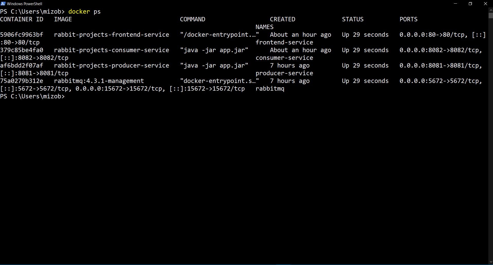
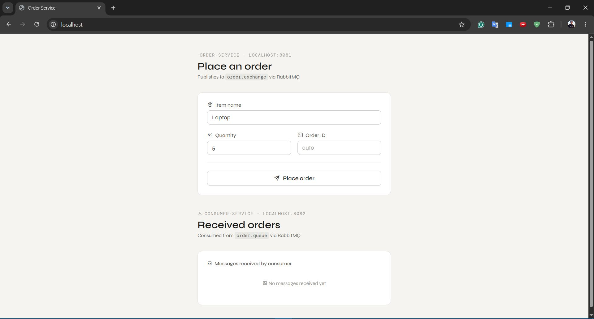
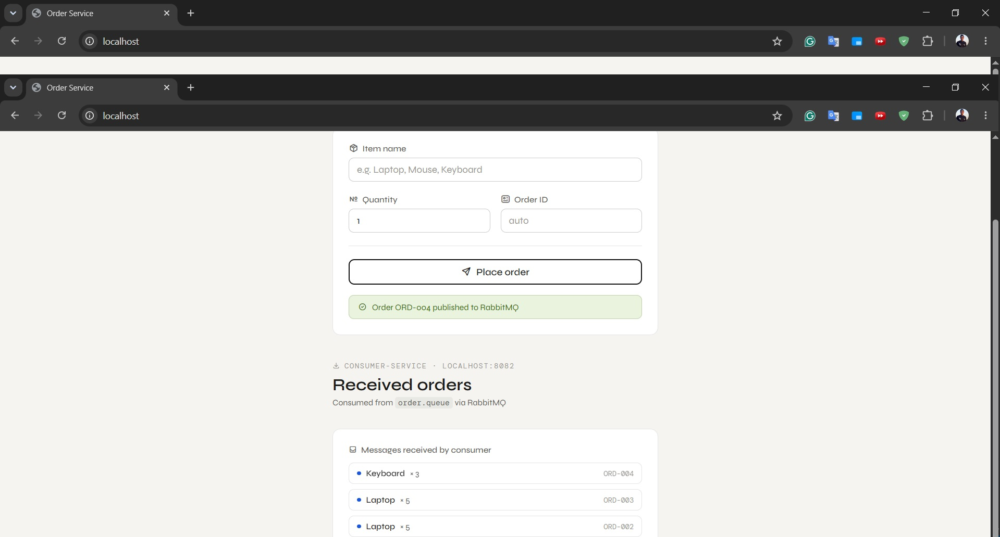
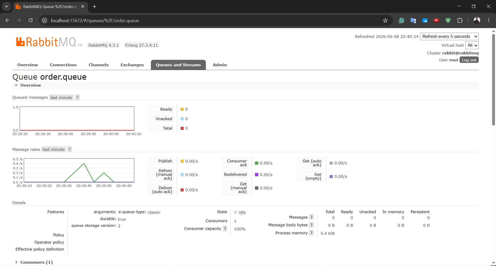
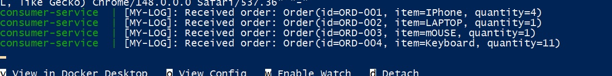

# RabbitMQ Order Service

A message-driven microservice demo using **Spring Boot 4**, **RabbitMQ**, and a static **HTML frontend**, fully containerized with **Docker Compose**.

## Architecture

```
Frontend (nginx :80)
    │
    ├── POST /api/orders ──► Producer Service (:8081) ──► RabbitMQ (:5672)
    │                                                         │
    └── GET  /messages   ◄── Consumer Service (:8082) ◄───────┘
```

| Service | Role |
|---------|------|
| **Producer** | Receives orders via REST, publishes them to RabbitMQ |
| **RabbitMQ** | Message broker — routes messages from producer to consumer |
| **Consumer** | Listens to the queue, stores orders in memory, exposes them via REST |
| **Frontend** | Sends orders and displays consumed messages |

## Message Flow

1. User fills out the order form on the frontend
2. Frontend sends `POST /api/orders` to the **Producer**
3. Producer serializes the order as JSON and publishes it to `order.exchange` with routing key `order.routing.key`
4. RabbitMQ routes the message to `order.queue` via a direct binding
5. **Consumer** receives the message via `@RabbitListener`, stores it in an in-memory list
6. Frontend polls `GET /messages` on the Consumer every 3 seconds and displays received orders

## RabbitMQ Topology

| Component | Name |
|-----------|------|
| Exchange | `order.exchange` (Direct) |
| Queue | `order.queue` (Durable) |
| Routing Key | `order.routing.key` |

## Tech Stack

- Java 21
- Spring Boot 4.0.6
- Spring AMQP
- RabbitMQ 4.3.1
- Lombok
- Nginx (frontend)
- Docker & Docker Compose

## How to Run

```bash
docker compose up --build
```

Once all 4 containers are running:

| Service | URL |
|---------|-----|
| Frontend | http://localhost |
| Producer API | http://localhost:8081/api/orders |
| Consumer API | http://localhost:8082/messages |
| RabbitMQ Management UI | http://localhost:15672 (user: `root` / pass: `root`) |

To stop:

```bash
docker compose down
```

## Screenshots

### 1. Docker Containers Running


### 2. Frontend — Place and send an Order


### 3. Frontend — Received Orders


### 4. RabbitMQ Management — Queues



### 5. Consumer Logs


## Project Structure

```
rabbit-projects/
├── docker-compose.yml
├── producer-service/
│   ├── Dockerfile
│   ├── pom.xml
│   └── src/main/java/gov/iti/jets/producerservice/
│       ├── config/          # RabbitMQ + CORS config
│       ├── controller/      # POST /api/orders
│       ├── messaging/       # RabbitTemplate publisher
│       └── model/           # Order (id, item, quantity)
├── consumer-service/
│   ├── Dockerfile
│   ├── pom.xml
│   └── src/main/java/gov/iti/jets/consumerservice/
│       ├── config/          # RabbitMQ + CORS config
│       ├── controller/      # GET /messages
│       ├── listener/        # @RabbitListener + in-memory store
│       └── model/           # Order (id, item, quantity)
└── frontend-service/
    ├── Dockerfile
    └── index.html
```
